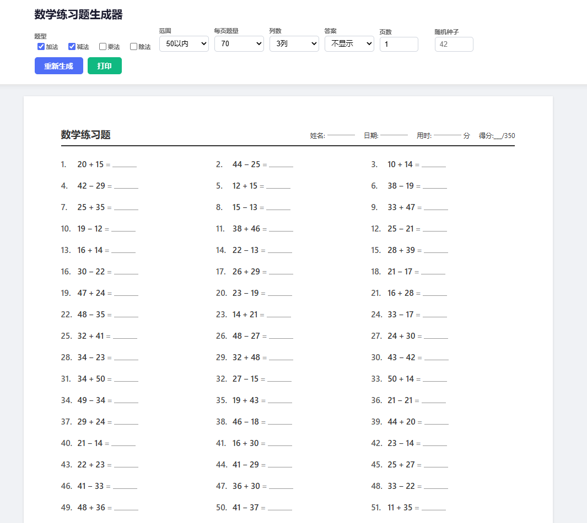

# 数学练习题生成器

> 儿童加减乘除练习题生成器 — **A4 可打印**，适合家长/老师快速出卷。



## 功能

- 支持 **加法**、**减法**、**乘法**、**除法**、**混合运算**
- 三级难度：简单 / 中等 / 困难
- 可配置题量（10-100 题）、列数（2/3/4 列）
- **单页** 或 **多页（自动分页）** 模式
- 答案显示：不显示 / 每题后 / 尾页汇总
- 可设置随机种子，同一种子生成相同题目（方便多次印刷）
- 实时预览，A4 打印样式（`@media print` 优化）
- 零依赖，打开即用

## 使用

1. 直接打开 `index.html`，或在 GitHub Pages 上访问
2. 在控制面板选择参数，点"重新生成"或按 `Ctrl+Enter`
3. 点"打印"或浏览器打印功能输出

## 技术栈

纯 HTML + CSS + JavaScript，无任何外部依赖。

## 项目结构

```
kids_math_paper/
├── index.html       # 主页面
├── css/style.css    # 屏幕 + A4 打印样式
├── js/engine.js     # 数学题目生成引擎
├── js/print.js      # 分页与打印布局
├── js/app.js        # 主应用逻辑
├── README.md
└── .gitignore
```
